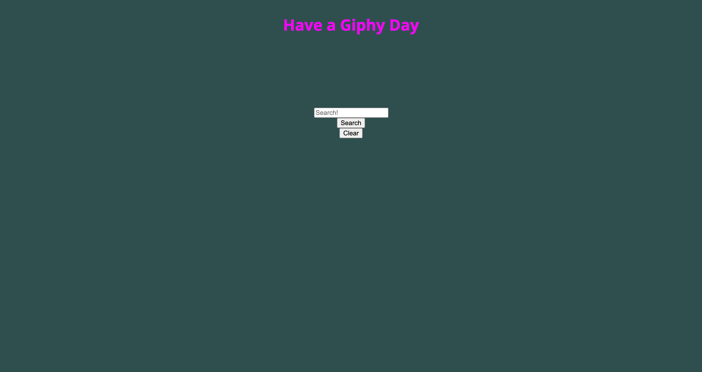
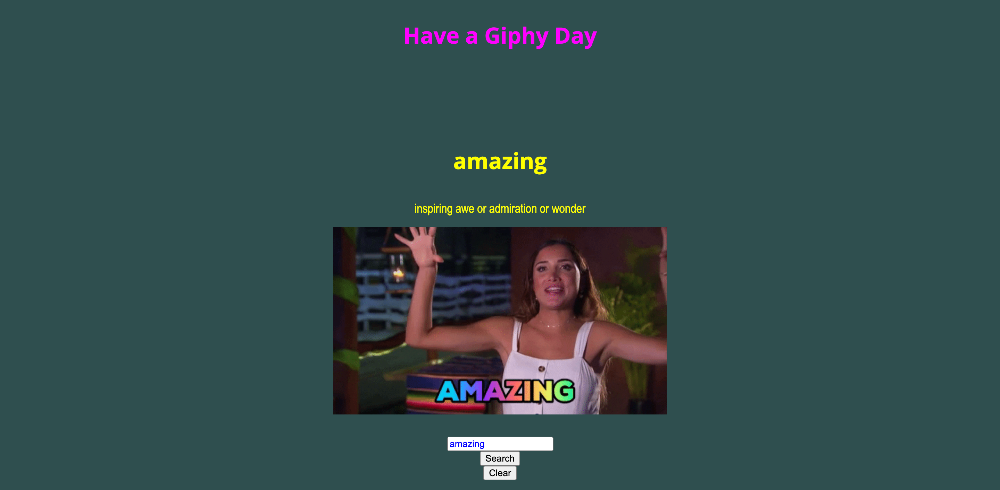

# have_a_giphy_day

USER STORY
As a school district, I want a web application that presents a fun way to introduce vocabulary building strategies each new day. When we click into the website, a random word and its definition is displayed, along with a giphy that corresponds to the word/definition displayed.

WHEN I go to the webpage
THEN I am presented with a input form, submit button and clear button
WHEN I type in a word
THEN the webpage returns its definition and a corresponding gif
WHEN I type in a another word
THEN that definition/gif is displayed underneath the previous word
WHEN I click "clear"
THEN the page refreshes, clearing the list

